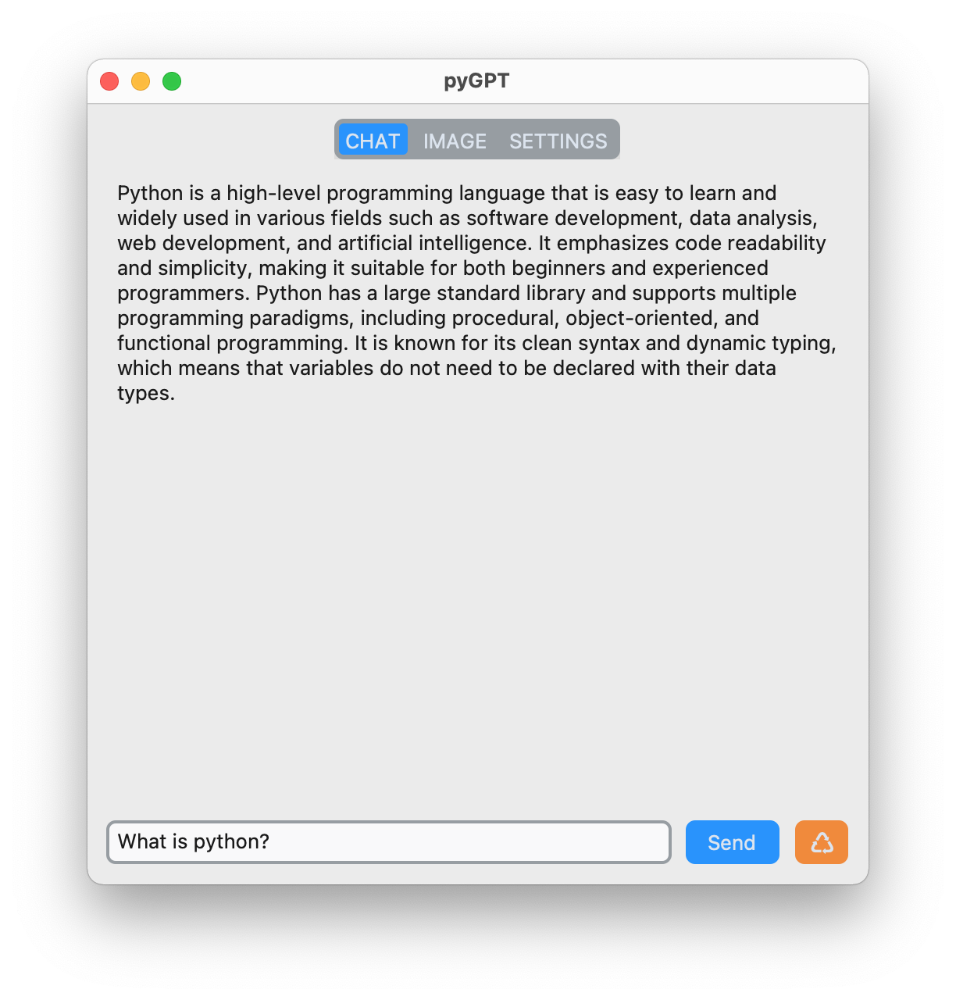

# pyGPT
[CustomTkinter](https://github.com/TomSchimansky/CustomTkinter) UI to interact with openAI API

  
   
  

## Implemented:
* **[ChatGPT](https://platform.openai.com/docs/models/gpt-4)**
* **[DALL·E](https://platform.openai.com/docs/models/dall-e)**

## Notes:
Made for educational purposes
